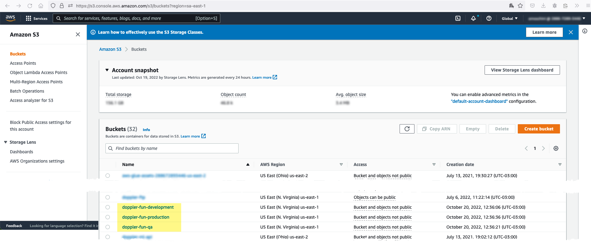
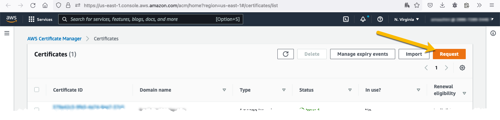
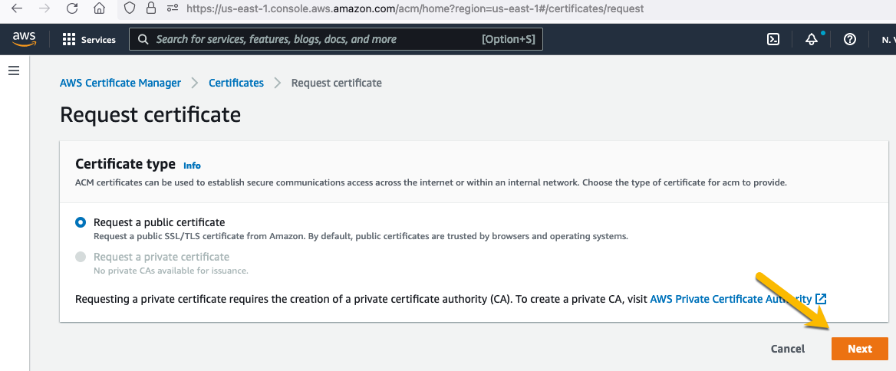
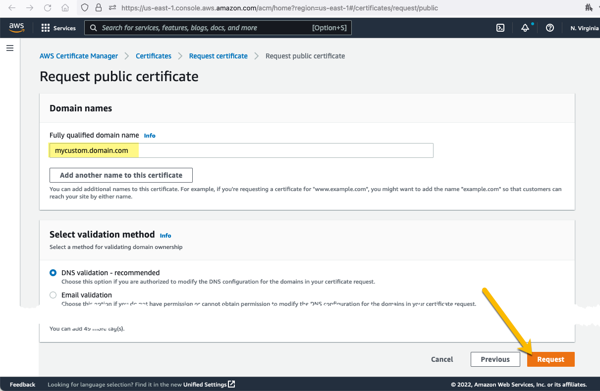
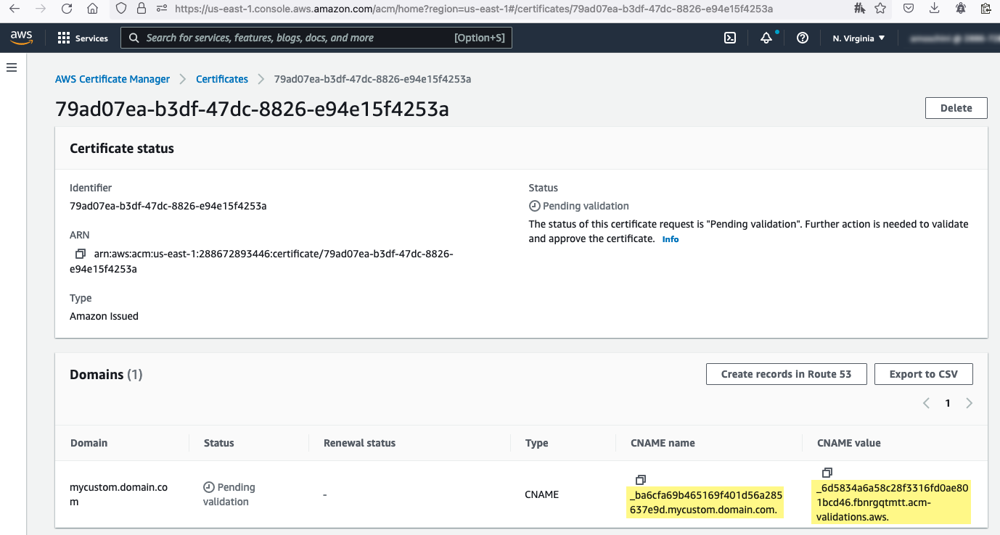
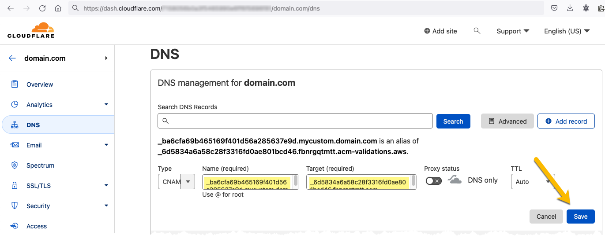
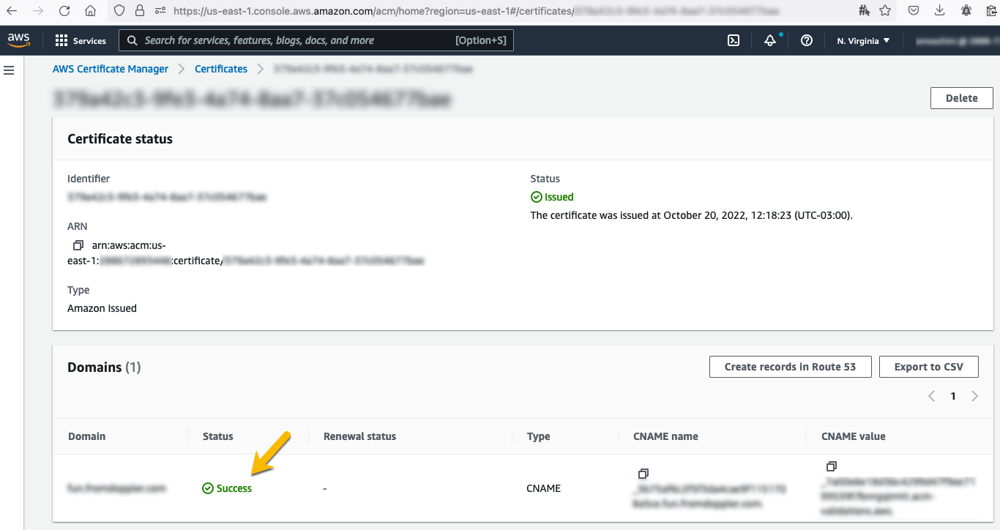
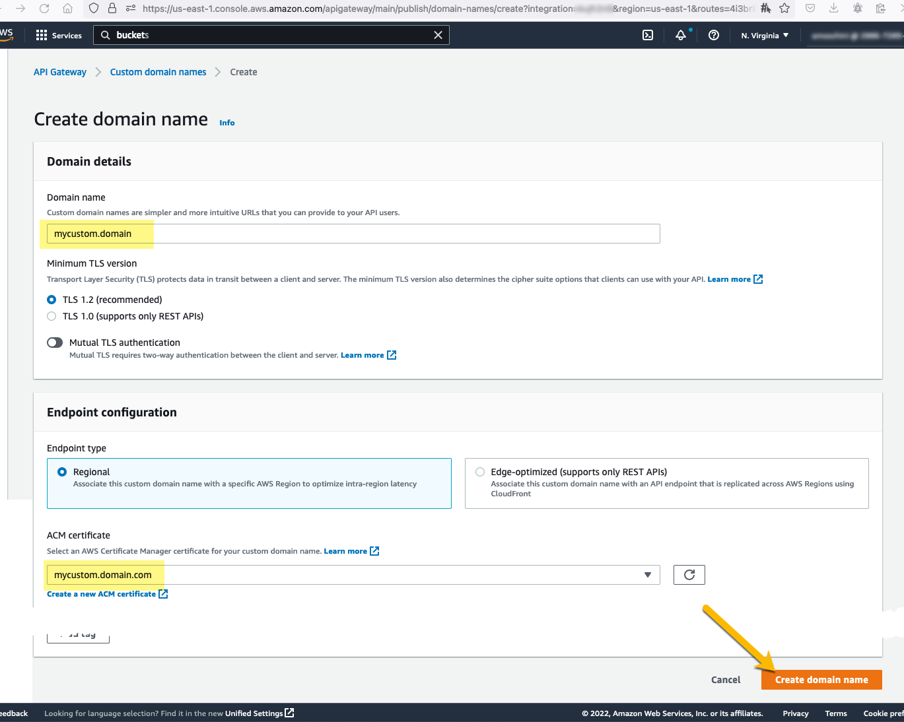
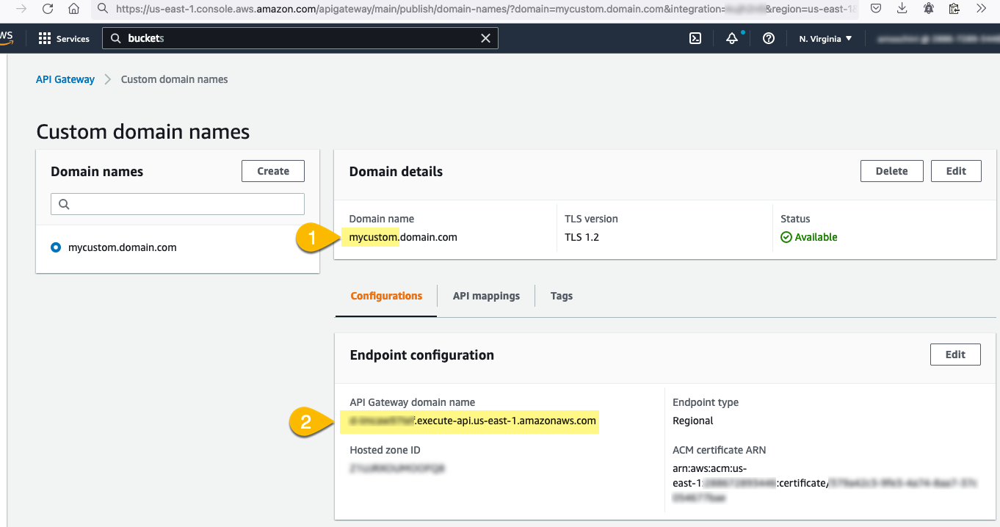
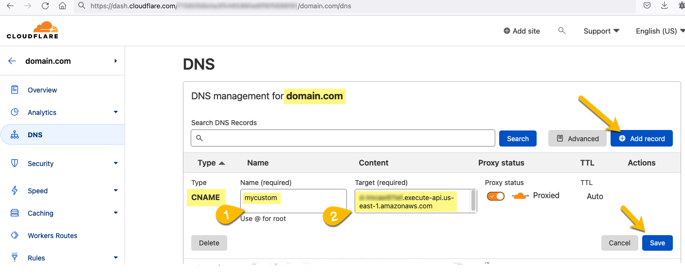

# Doppler System Usage

It is a simple HTTP API that allows Doppler client side services to register what features the user access to, and expose a summary.

This is our first production Doppler service based on Node.js running on AWS Lambda and API Gateway using the Serverless Framework.

See https://github.com/FromDoppler/aws-node-http-api-project for details about related POC.

## Manual setup

### Buckets

For the moment, we decided to share a bucket for all lambda functions in the same environment, so we have three:

- `doppler-fun-int-us-east-2`
- `doppler-fun-qa-us-east-2`
- `doppler-fun-production-us-east-2`

Each of them has been created manually using the [S3 Buckets page](https://s3.console.aws.amazon.com/s3/buckets?region=sa-east-2).



### Custom domain

We are using a custom domain for each environment:

- `{custom-domain}.fromdoppler.com/lambdas-poc/` ➡ `lambdas-poc-production` API
- `{custom-domain}qa.fromdoppler.net/lambdas-poc/` ➡ `lambdas-poc-qa` API
- `{custom-domain}int.fromdoppler.net/lambdas-poc/` ➡ `lambdas-poc-int` API

Our custom domain is managed by Cloudflare.

#### Step by step configuration

1. Create a certificate







2. Validate certificate







3. Create custom domain in AWS



4. Add DNS to the custom domain





5. Configure mappings

Now it is done by code 😀

## Usage

### Deployment

```
$ serverless deploy
```

After deploying, you should see output similar to:

```bash
Deploying doppler-system-usage to stage dev (us-east-1)

✔ Service deployed to stack doppler-system-usage-dev (152s)

endpoint: GET - https://xxxxxxxxxx.execute-api.us-east-2.amazonaws.com/
functions:
  hello: doppler-system-usage-dev-hello (1.9 kB)
```

### Invocation

After successful deployment, you can call the created application via HTTP:

```bash
curl https://xxxxxxx.execute-api.us-east-2.amazonaws.com/
```

Which should result in response similar to the following (removed `input` content for brevity):

```json
{
  "message": "Go Serverless v2.0! Your function executed successfully!",
  "input": {
    ...
  }
}
```

### Local development

You can invoke your function locally by using the following command:

```bash
serverless invoke local --function hello
```

Which should result in response similar to the following:

```
{
  "statusCode": 200,
  "body": "{\n  \"message\": \"Go Serverless v3.0! Your function executed successfully!\",\n  \"input\": \"\"\n}"
}
```

Alternatively, it is also possible to emulate API Gateway and Lambda locally by using `serverless-offline` plugin, you can start local emulation with:

```
serverless shn run-offline.sh
```

To learn more about the capabilities of `serverless-offline`, please refer to its [GitHub repository](https://github.com/dherault/serverless-offline).
